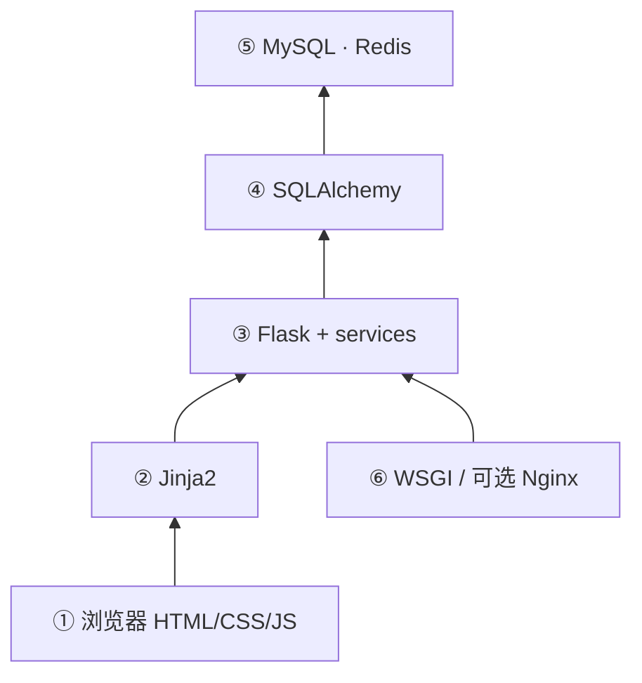

# MAPS / MMDAPS 分层架构说明（与当前实现对齐）

## 概述

平台采用**分层架构**：浏览器端呈现与 **REST/JSON API**、**服务端渲染页面**协同；业务规则集中在 Flask 与 `services/`；关系型数据经 **SQLAlchemy ORM** 访问；**默认使用 MySQL** 持久化（开发可无 MySQL 时回退 SQLite，见 `config.py`）；**Redis** 用于 BAGEL 等异步队列与任务状态缓存；生产环境可在 **WSGI 服务外**前置 **Nginx**（HTTPS、静态资源、反向代理），与业务代码解耦。

---

## 各层职责

### ① 用户界面层（浏览器端）

基于 **HTML5、CSS**（如 **Bootstrap**）与**原生 JavaScript**（`fetch`、DOM 操作），配合 **Chart.js** 等脚本；页面由服务端生成，交互以表单、表格、分页与异步刷新为主。**非 Vue/React 单页工程**（仓库内无独立前端构建链路）。

### ② 表示层（服务端模板）

**Flask + Jinja2** 将业务数据注入模板，输出中英文等页面（如 `*_cn.html` / `*_en.html`），统一导航与布局，降低前后端契约复杂度。

### ③ 应用与业务逻辑层

**Flask** 注册路由与 **JSON API**；业务拆分为 **`services/`**（数据管理、任务工作流、消息、BAGEL 队列客户端等），覆盖多模态上传/采集元数据、处理结果、审核、任务、消息与用户管理等能力。

### ④ 持久化抽象层

**SQLAlchemy（Flask-SQLAlchemy）** 定义模型（`models.py`）并封装查询与事务，避免业务层直接编写 SQL。

### ⑤ 数据与基础设施层

- **MySQL**：默认主库（`mysql+pymysql`，**utf8mb4**），存放用户、任务、录制与元数据、审核与消息等关系数据。  
- **Redis**：异步任务队列与结果缓存（如 BAGEL），按需启用。  
- **SQLite**：仅当设置 `MMDAPS_USE_SQLITE=1` 时作为本地开发回退。

### ⑥ 运行与部署环境

**Flask 应用**运行于 **WSGI 服务器**（如 gunicorn、waitress）；**Nginx** 为典型生产侧组件（本仓库不包含 Nginx 配置，由部署方案提供）。

---

## 架构图（Mermaid）

将以下代码块复制到支持 Mermaid 的编辑器即可渲染（与上文分层一一对应）。

```mermaid
flowchart TB
  subgraph ⑥["⑥ 运行与部署环境"]
    WSGI["WSGI 服务 · Flask 应用"]
    NX["Nginx HTTPS / 静态资源 / 反代（生产可选）"]
  end

  subgraph ①["① 用户界面层 · 浏览器"]
    UI["HTML5 / CSS / Bootstrap"]
    JS["原生 JavaScript · fetch · Chart.js 等"]
  end

  subgraph ②["② 表示层"]
    J2["Jinja2 模板 · render_template"]
  end

  subgraph ③["③ 应用与业务逻辑层"]
    RT["Flask 路由与 JSON API"]
    SV["services/ 业务模块"]
  end

  subgraph ④["④ 持久化抽象层"]
    ORM["SQLAlchemy ORM · models.py"]
  end

  subgraph ⑤["⑤ 数据与基础设施层"]
    MY[("MySQL InnoDB utf8mb4")]
    RD[("Redis · 队列与缓存")]
  end

  NX --> WSGI
  WSGI --> RT
  UI --> J2
  JS --> RT
  J2 --> RT
  RT --> SV
  RT --> ORM
  SV --> ORM
  ORM --> MY
  SV -. BAGEL 等 .-> RD
```

### 简化的纵向依赖图（备选）



---

## 数据库配置摘要

| 方式 | 说明 |
|------|------|
| `DATABASE_URL` | 最高优先级，任意 SQLAlchemy 支持的 URL |
| `MYSQL_*` + 默认 | 未设 `DATABASE_URL` 且未启用 SQLite 时，拼装 `mysql+pymysql://...?charset=utf8mb4` |
| `MMDAPS_USE_SQLITE=1` | 使用项目目录下 `mmdaps_local.db` |

详见项目根目录 **`.env.example`** 与 **`config.py`**。
