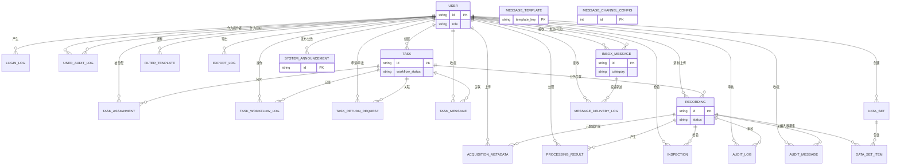

# MMDAPS 数据库概念结构与逻辑模型说明

本文档汇总当前 `models.py` 中定义的全部数据表，给出**概念结构设计**文字说明，并提供 **E-R 图**与**实体关系逻辑数据模型图**的 Mermaid 源码（可在支持 Mermaid 的 Markdown 预览、Typora、GitHub、VS Code 插件中渲染）。

---

## 1. 数据表一览

| 序号 | 物理表名 | 说明（业务含义） |
|------|----------|------------------|
| 1 | `users` | 系统用户：账号、角色、部门、密码与安全状态、会话版本等 |
| 2 | `login_logs` | 登录/登出及失败尝试审计（IP、UA、事件类型） |
| 3 | `user_audit_logs` | 用户账号类操作审计（操作者、目标用户、动作、详情 JSON） |
| 4 | `tasks` | 业务任务：工作流状态、分配模式、截止时间、评分与复核信息等 |
| 5 | `task_assignments` | 任务与用户的多对多执行关系（配额、申领公海标记等） |
| 6 | `task_workflow_logs` | 任务状态流转与操作审计日志 |
| 7 | `task_return_requests` | 公海任务退领申请及审批结果 |
| 8 | `task_messages` | 任务相关站内通知（兼容旧版，可与统一收件箱并存） |
| 9 | `recordings` | 多模态数据记录：文件、状态、字幕、逻辑删除与关联任务 |
| 10 | `acquisition_metadata` | 采集/上传元数据：MD5、任务编号、审核状态、来源渠道等 |
| 11 | `processing_results` | 数据处理结果：转写/描述文本、时间轴 JSON、算法原始输出等 |
| 12 | `inspections` | 历史/兼容维度检验记录（与审核流程并存时可查） |
| 13 | `audit_logs` | 数据审核操作留痕（通过、打回修正、审核员自修等） |
| 14 | `audit_messages` | 审核打回等场景的站内消息（兼容旧版） |
| 15 | `filter_templates` | 用户保存的数据列表筛选条件模板 |
| 16 | `data_sets` | 自定义数据集（名称、版本、描述） |
| 17 | `data_set_items` | 数据集与录音记录的多对多成员关系 |
| 18 | `export_logs` | 数据导出行为审计（范围、格式、字段、条数） |
| 19 | `inbox_messages` | 统一站内信收件箱（任务/审核/账号/系统，支持置顶与逻辑删除） |
| 20 | `message_delivery_logs` | 消息投递审计（站内/邮件/短信渠道与状态快照） |
| 21 | `message_templates` | 可配置消息模板（标题/正文模板、优先级、启停） |
| 22 | `system_announcements` | 系统公告（富文本、有效期、受众 JSON、发布时间） |
| 23 | `message_channel_config` | 消息渠道全局配置单例（邮件/短信开关、角色范围） |

**合计：23 张业务与配置表**（不含 ORM 中间表；`message_channel_config` 约定使用 `id=1` 单例行）。

---

## 2. 数据库概念结构设计（文字描述）

多模态数据采集处理系统的数据组织以 **「用户（User）」** 为安全与权限中枢：所有登录审计、账号变更审计、任务参与、数据上传与处理、审核动作、导出与消息投递均与用户实体建立联系。核心业务由 **「任务（Task）」** 驱动：任务具有生命周期与工作流状态，通过 **任务分配（TaskAssignment）** 将执行责任落实到具体用户；任务操作过程写入 **任务工作流日志（TaskWorkflowLog）**，公海场景下 **退领申请（TaskReturnRequest）** 记录执行人释放配额的审批闭环。

**「录音/数据记录（Recording）」** 表示系统中的多模态资产实体，与上传人、可选业务任务、处理与审核链路相连。**采集元数据（AcquisitionMetadata）** 从合规与检索角度对每条记录补充 MD5、任务编号、审核状态等；**处理结果（ProcessingResult）** 承载算法或人工处理产出；**审核日志（AuditLog）** 与 **审核消息（AuditMessage）** 支撑质检打回与修正闭环。**数据集（DataSet + DataSetItem）** 在记录之上提供可版本化的资产编目能力；**筛选模板（FilterTemplate）** 与 **导出日志（ExportLog）** 支撑数据管理侧的个人效率与审计。

**消息子系统**在概念上分为三层：**统一收件箱（InboxMessage）** 面向最终用户的可读信箱；**投递日志（MessageDeliveryLog）** 面向合规的不可篡改发送轨迹；**模板（MessageTemplate）**、**公告（SystemAnnouncement）** 与 **渠道配置（MessageChannelConfig）** 支撑内容与触达策略的配置化管理。用户与各类日志表（登录、用户审计、任务工作流、审核、导出、消息投递）形成典型的 **「主实体—从属审计」** 结构，便于按时间、主体、业务对象多维追溯。

整体上，概念模型体现 **RBAC 用户中心 + 任务驱动流程 + 多模态数据主线 + 审核与消息协同** 四大域的交叉关联，外键保证引用完整性，大量时间戳与 JSON 扩展字段平衡了结构化查询与业务演进弹性。

---

## 3. E-R 图（概念层，突出实体与联系）

以下为 **概念级** E-R 图：强调实体语义与基数关系，不展开全部属性。使用 Mermaid `erDiagram` 语法。



> 说明：`MESSAGE_TEMPLATE`、`MESSAGE_CHANNEL_CONFIG` 为全局/单例配置实体，**不与其他表建立外键**；`SYSTEM_ANNOUNCEMENT` 由 `USER` 创建（逻辑模型见第 4 节）。概念图中仅标示其存在。

---

## 4. 实体关系逻辑数据模型图（表级 PK/FK）

以下为 **逻辑关系模型**：以表为节点、以外键引用为主边，便于对照 `models.py` 实现。属性仅标出 **主键** 与 **关键外键**。

```mermaid
erDiagram
    users ||--o{ login_logs : "user_id"
    users ||--o{ user_audit_logs : "actor_id"
    users ||--o{ user_audit_logs : "target_user_id"
    users ||--o{ tasks : "created_by"
    users ||--o{ tasks : "scored_by"
    users ||--o{ task_assignments : "user_id"
    users ||--o{ task_workflow_logs : "user_id"
    users ||--o{ task_return_requests : "user_id"
    users ||--o{ task_return_requests : "reviewed_by"
    users ||--o{ task_messages : "recipient_id"
    users ||--o{ task_messages : "sender_id"
    users ||--o{ recordings : "recorded_by"
    users ||--o{ recordings : "invalidated_by"
    users ||--o{ acquisition_metadata : "uploader_id"
    users ||--o{ processing_results : "processor_id"
    users ||--o{ inspections : "inspector_id"
    users ||--o{ audit_logs : "auditor_id"
    users ||--o{ audit_messages : "recipient_id"
    users ||--o{ audit_messages : "sender_id"
    users ||--o{ filter_templates : "user_id"
    users ||--o{ data_sets : "created_by"
    users ||--o{ export_logs : "user_id"
    users ||--o{ inbox_messages : "recipient_id"
    users ||--o{ inbox_messages : "sender_id"
    users ||--o{ message_delivery_logs : "recipient_id"
    users ||--o{ message_delivery_logs : "sender_id"
    users ||--o{ system_announcements : "created_by"

    tasks ||--o{ task_assignments : "task_id"
    tasks ||--o{ task_workflow_logs : "task_id"
    tasks ||--o{ task_return_requests : "task_id"
    tasks ||--o{ task_messages : "task_id"
    tasks ||--o{ recordings : "business_task_id"

    recordings ||--o{ acquisition_metadata : "recording_id"
    recordings ||--o{ processing_results : "recording_id"
    recordings ||--o{ inspections : "recording_id"
    recordings ||--o{ audit_logs : "recording_id"
    recordings ||--o{ audit_messages : "recording_id"
    recordings ||--o{ data_set_items : "recording_id"

    data_sets ||--o{ data_set_items : "dataset_id"

    inbox_messages ||--o{ message_delivery_logs : "inbox_message_id"

    users {
        int id PK
        string username UK
        string email UK
    }
    tasks {
        int id PK
        string task_no UK
        int created_by FK
        int scored_by FK
    }
    recordings {
        int id PK
        int recorded_by FK
        int invalidated_by FK
        int business_task_id FK
    }
    task_assignments {
        int id PK
        int task_id FK
        int user_id FK
    }
    acquisition_metadata {
        int id PK
        int recording_id FK
        int uploader_id FK
    }
    processing_results {
        int id PK
        int recording_id FK
        int processor_id FK
    }
    audit_logs {
        int id PK
        int recording_id FK
        int auditor_id FK
    }
    data_sets {
        int id PK
        int created_by FK
    }
    data_set_items {
        int id PK
        int dataset_id FK
        int recording_id FK
    }
    inbox_messages {
        int id PK
        int recipient_id FK
        int sender_id FK
    }
    message_delivery_logs {
        int id PK
        int inbox_message_id FK
        int recipient_id FK
        int sender_id FK
    }
    system_announcements {
        int id PK
        int created_by FK
    }
    message_templates {
        int id PK
        string template_key UK
    }
    message_channel_config {
        int id PK
    }
```



### 独立表（逻辑模型中无外键指向其他业务表）

| 表名 | 说明 |
|------|------|
| `message_templates` | 模板主键 `id`，`template_key` 唯一；不引用 `users` |
| `message_channel_config` | 全局单行配置，通常仅 `id=1` |

---

## 5. 可选：DBML 逻辑模型片段

若使用 [dbdiagram.io](https://dbdiagram.io) 等工具，可将下列 DBML 作为逻辑模型起点继续细化字段类型。

```dbml
Table users {
  id int [pk, increment]
  username varchar [unique, not null]
  email varchar [unique, not null]
}

Table tasks {
  id int [pk, increment]
  task_no varchar [unique]
  created_by int [ref: > users.id]
  scored_by int [ref: > users.id]
}

Table recordings {
  id int [pk, increment]
  recorded_by int [ref: > users.id]
  invalidated_by int [ref: > users.id]
  business_task_id int [ref: > tasks.id]
}

Table task_assignments {
  id int [pk, increment]
  task_id int [ref: > tasks.id]
  user_id int [ref: > users.id]
}

Table acquisition_metadata {
  id int [pk, increment]
  recording_id int [ref: > recordings.id]
  uploader_id int [ref: > users.id]
}

Table processing_results {
  id int [pk, increment]
  recording_id int [ref: > recordings.id]
  processor_id int [ref: > users.id]
}

Table audit_logs {
  id int [pk, increment]
  recording_id int [ref: > recordings.id]
  auditor_id int [ref: > users.id]
}

Table data_sets {
  id int [pk, increment]
  created_by int [ref: > users.id]
}

Table data_set_items {
  id int [pk, increment]
  dataset_id int [ref: > data_sets.id]
  recording_id int [ref: > recordings.id]
  Note: 'Unique (dataset_id, recording_id)'
}

Table inbox_messages {
  id int [pk, increment]
  recipient_id int [ref: > users.id]
  sender_id int [ref: > users.id, null]
}

Table message_delivery_logs {
  id int [pk, increment]
  inbox_message_id int [ref: > inbox_messages.id, null]
  recipient_id int [ref: > users.id]
  sender_id int [ref: > users.id, null]
}

Table system_announcements {
  id int [pk, increment]
  created_by int [ref: > users.id]
}

Table message_templates {
  id int [pk, increment]
  template_key varchar [unique, not null]
}

Table message_channel_config {
  id int [pk]
}
// 其余 login_logs, user_audit_logs, task_workflow_logs, task_return_requests,
// task_messages, inspections, audit_messages, filter_templates, export_logs
// 均可按 models.py 补全 FK 定义。
```

---

*文档版本与 `models.py` 同步维护；若增减表或外键，请同步更新本节图表。*
