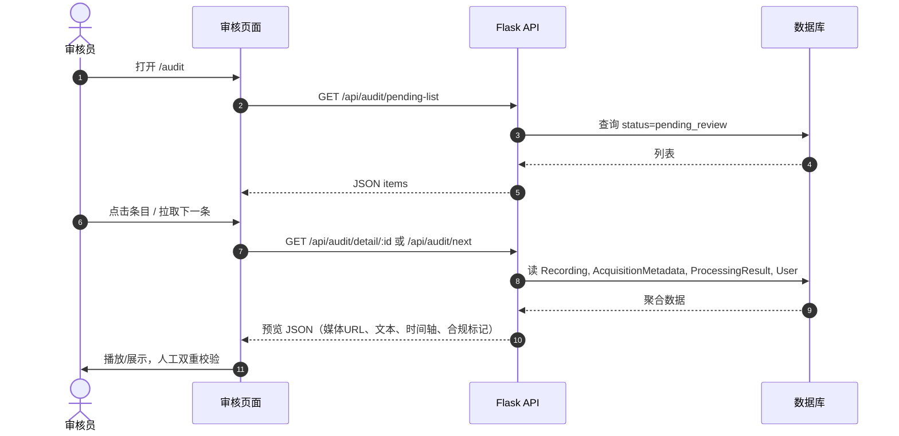
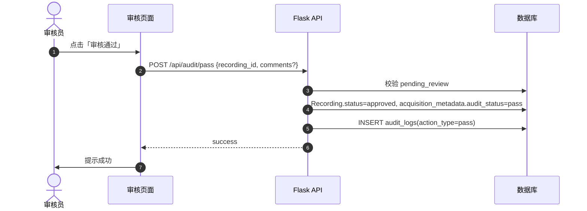
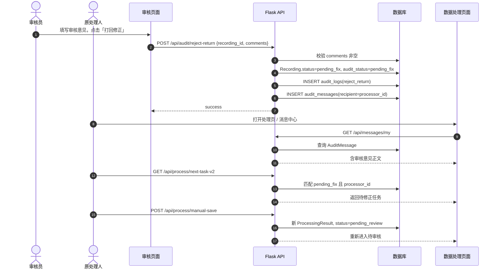
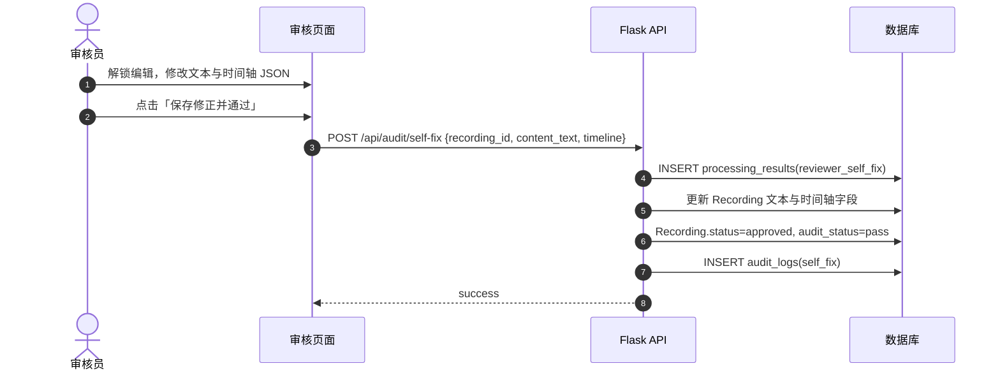
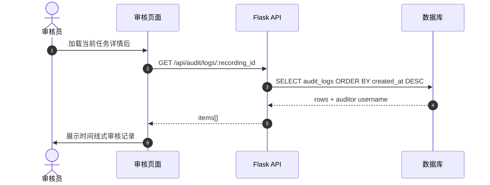

# 数据审核模块 — 详细设计（展开版）

本文档在「概要设计」基础上，对数据审核模块作**中文展开说明**，并与当前代码实现保持一致（`app.py`、`models.py`、`audit_cn.html` / `audit_en.html`）。

---

## 0. 背景与定位

### 0.1 业务背景

多模态数据在**采集、处理**之后，若直接进入下游分析或对外提供，存在质量不可控、责任不可追溯等问题。数据审核模块是质量管控的**核心关卡**：由具备权限的**质检审核人员**在统一界面中完成「看内容、对规范、判结果」，形成 **处理 → 审核 →（必要时）修正 → 归档** 的闭环。

### 0.2 模块在系统中的位置

| 上游 | 本模块 | 下游（逻辑上） |
|------|--------|----------------|
| 数据处理（转写、描述、时间轴提交） | 待审核队列、预览、判定、留痕 | 「合规数据」视图、统计、导出（可与数据管理/任务模块联动） |

衔接条件：当某条 `Recording` 的处理结果被提交后，系统将 `status` 置为 **`pending_review`**，该条即进入审核队列。

### 0.3 术语表

| 术语 | 含义 |
|------|------|
| 待审核 | 已提交处理结果、等待审核员判定的状态（`pending_review`） |
| 打回 / 待修正 | 审核不通过且需原处理人修改（`pending_fix`） |
| 通过 / 归档 | 审核认定可入库；本系统中 **`approved` 表示逻辑归档**（数据仍在同一业务库，可在管理界面按状态筛选） |
| 自行处理 | 审核员认为问题较小，不经打回，直接在审核页改文案/时间轴后一次通过 |
| 留痕 | 每次审核操作写入 `audit_logs`，可追溯「谁、何时、何种操作、何意见」 |

---

## 1. 目标与范围

### 1.1 建设目标

1. **标准化**：审核入口、预览内容、三种结果分支一致，减少口头传递与遗漏。  
2. **可控性**：不合规数据不进入「已通过」状态；打回必须附带可执行意见。  
3. **可追溯**：所有分支均写日志，满足内审与外审对流程的要求。  
4. **闭环**：打回后原处理人可再次提交，重新进入待审核。

### 1.2 范围说明（做什么 / 不做什么）

**范围内：**

- 按角色展示待审核列表、单条详情预览；
- 合规性**辅助信息**（文件是否可读、元数据是否齐全等）；
- 审核通过、打回修正（含站内消息）、审核员自行修正并通过；
- 审核与打回相关的数据库记录与 API。

**范围外（可后续扩展）：**

- 自动 ASR/视频理解与「机审分数」——当前准确性判断依赖**人工**；
- 与具体「任务单」表强制绑定并自动递增 `completed_count`——需增加 `recording ↔ task` 关联后实现；
- 短信、邮件、企业微信等外部推送——当前仅 `audit_messages` 表 + HTTP API，可对接统一消息中心。

### 1.3 角色与权限

| 角色 | 代码中 `role` | 审核能力 |
|------|----------------|----------|
| 审核员 | `inspector` | 可访问 `/audit` 及 `/api/audit/*`（消息接口对所有登录用户开放） |
| 管理员 | `admin` | 与审核员相同；另可代处理打回数据（见下文 `manual-save`） |
| 采集/处理员 | `recorder` 等 | 不可进入审核页；可收到打回消息、领取 `pending_fix` 任务并再次提交 |

---

## 2. 业务参与者与典型场景

### 2.1 参与者

- **审核员（Reviewer）**：从队列取任务、预览、执行双重校验、选择通过/打回/自行处理。  
- **处理员（Processor）**：对 `pending` 数据做转写/描述；若被打回，在 `pending_fix` 下修正并再次提交。  
- **系统**：维护状态、写日志、写消息、提供受控媒体 URL。

### 2.2 典型场景（文字描述）

**场景 A — 一次通过**  
处理员提交 → 状态 `pending_review` → 审核员预览无误 → 「审核通过」→ `approved` + 日志。

**场景 B — 打回再审**  
审核员发现转写与音频不符 → 填写意见（含时间段等）→ 打回 → `pending_fix` + 消息 → 处理员修改 → `manual-save` → 再次 `pending_review` → 审核员复检。

**场景 C — 小错当场改**  
时间轴仅差 0.5 秒、个别错字 → 审核员勾选解锁编辑 → 自行修正 → 「保存修正并通过」→ 新增一条 `reviewer_self_fix` 处理记录 + `approved` + 日志。

---

## 3. 状态机与生命周期（展开）

### 3.1 与审核相关的主状态迁移

```
                    ┌──────────────────────────────────────┐
                    │           pending（待处理）            │
                    └─────────────────┬────────────────────┘
                                      │ 处理提交
                                      ▼
                    ┌──────────────────────────────────────┐
                    │      pending_review（待审核）         │
                    └─────┬──────────────┬─────────────────┘
                          │              │
           审核通过       │              │ 打回修正
           (pass)         │              │ (reject-return)
                          ▼              ▼
                    ┌──────────┐   ┌─────────────────┐
                    │ approved │   │  pending_fix    │
                    │ (归档)   │   │  （待修正）      │
                    └──────────┘   └────────┬────────┘
                                            │ 原处理人/管理员保存修正
                                            ▼
                              再次 pending_review …
```

**自行处理**路径：在 **`pending_review`** 上由审核员调用 `self-fix`，**不经过** `pending_fix`，直接到 **`approved`**。

### 3.2 与 `acquisition_metadata.audit_status` 的对应关系

为便于按「采集批次/任务编号」做统计，元数据表上单独维护审核子状态：

| 主状态 `recordings.status` | 建议同步的 `audit_status` |
|----------------------------|---------------------------|
| `pending_review` | `pending`（表示「已送审、尚未裁定」） |
| `approved` | `pass` |
| `pending_fix` | `pending_fix` |

进入待审核时（处理提交），代码会将 `audit_status` 置为 **`pending`**，与「正在审核流程中」语义一致。

### 3.3 历史状态说明

系统中可能仍存在 `completed`、`rejected`、`processing` 等旧状态（例如早期「类型1检查」流程）。新审核闭环以 **`pending_review` → `approved` / `pending_fix`** 为主轴；旧接口产生的状态与 **`legacy_inspect`** 类型日志可在迁移期并存。

---

## 4. 数据模型（展开）

### 4.1 核心实体关系（文字 ER）

- **User**：审核员、处理员、上传者。  
- **Recording**：一条多模态文件的业务主记录；**status** 驱动审核生命周期。  
- **AcquisitionMetadata**：与 Recording 1:1（业务上），存 MD5、任务编号、来源、**audit_status**。  
- **ProcessingResult**：与 Recording 1:N，每次处理或审核员修正可追加一行，保留历史。  
- **AuditLog**：与 Recording 1:N，**每次审核操作一行**，用于审计。  
- **AuditMessage**：与 User（收件人）、Recording 可选关联；**打回时**插入。

### 4.2 `audit_logs` 字段职责（展开）

| 字段 | 类型意图 | 说明 |
|------|----------|------|
| `recording_id` | 关联数据 | 被审核的那条录制 |
| `auditor_id` | 责任人 | 实际操作账号（审核员或管理员） |
| `action_type` | 操作分类 | `pass`：纯通过；`reject_return`：打回；`self_fix`：审核员改后通过；`legacy_inspect`：旧版检查接口 |
| `audit_result` | 结果语义 | 如 `approved`、`pending_fix`、`rejected`，便于报表过滤 |
| `comments` | 可读意见 | 打回时与业务要求一致，应**具体**（如「12.3s–15.0s 与人声不符」） |
| `detail_json` | 机读扩展 | 可存片段数、processor_id、旧版 action 等，供深度审计或对接外部系统 |
| `created_at` | 时间戳 | 不可篡改依赖应用层；数据库层可配合只增不改策略 |

### 4.3 `audit_messages` 与「消息管理模块」

当前实现为**最小可用**：打回时插入一条记录，处理员通过 **`GET /api/messages/my`** 拉取。  
若未来建设统一消息中心，可：

- 保留本表作为「审核类消息」子类，或  
- 由消息服务订阅「打回事件」再分发，本表作冗余或废弃。

**收件人判定规则（展开）：**

1. 取该 `recording_id` 下 **`processing_results` 按 `processed_at` 最新一条** 的 `processor_id`；  
2. 若无（极端情况），回退为 **`recordings.recorded_by`**，避免消息无人接收。

### 4.4 `ProcessingResult` 与版本追溯

- 处理员每次 **`manual-save` / 转写提交 / 算法确认** 会新增一行（或覆盖策略由业务定；当前实现为**新增**为主）。  
- 审核员 **`self-fix`** 会新增 **`process_mode = reviewer_self_fix`** 的一行，从而在数据库中区分「处理员产出」与「审核员订正产出」，便于争议时还原。

---

## 5. 功能设计（逐项展开）

### 5.1 审核任务接收与「分配」策略

**列表拉取**（`GET /api/audit/pending-list`）：

- 过滤条件：`recordings.status == 'pending_review'`。  
- 排序：一般按 `created_at` 升序，体现**先提交先审**（FIFO）。  
- 列表项展示：内部 ID、文件名、模态类型、采集任务编号、**最近处理人用户名**等，便于审核员挑选或核对责任。

**取下一条**（`GET /api/audit/next`）：

- 与列表同一过滤条件，取 FIFO **第一条**，适合「流水作业」式审核。  
- **注意**：当前未实现「按审核员负载均衡」或「按专题锁定」；若同一机构多审核员并发，需在业务上约定是否允许重复打开同一条，或后续加「领取/锁定」字段。

**单条详情**（`GET /api/audit/detail/<id>`）：

- 仅当该条仍为 **`pending_review`** 时返回完整预览；否则返回错误，避免对已归档或已打回数据误操作。

### 5.2 数据预览内容（与需求逐条对应）

预览聚合接口内部会组装（概念上）以下块：

1. **数据来源与责任信息**  
   - 来源渠道：`upload` / `record` / `crawl`（来自 `AcquisitionMetadata.source_channel`）。  
   - 上传人、**处理人**（来自最近一次 `ProcessingResult` 与 `User` 表）。  

2. **元数据记录**  
   - 任务编号、MD5、上传时间、文件类型等，用于核对「采集规范」是否填全。  

3. **多模态内容在线预览**  
   - 根据扩展名判断 **audio / video**（及图片等），返回相对 URL：`/uploads/<filename>`（需登录后访问）。  
   - 前端用 `<audio>` / `<video>` / `` 播放或展示。  

4. **转写 / 描述文本**  
   - 与 `Recording.text_content` 及最近 `ProcessingResult.content_text` 一致策略：以界面展示为准写回字段。  

5. **时间轴与关键内容对应**  
   - 自 `ProcessingResult.timeline_json` 解析为数组，表格展示 **起止时间 + 文本**，便于核对「节点是否对齐画面/声音」。  

**系统不替代人工判断的部分**：  
「音频与转写是否一致」「描述与场景是否匹配」属于**准确性校验**，必须由审核员结合播放器与文本完成；系统只负责**把材料摆在同一屏**。

### 5.3 合规性辅助标记（与「合规性校验」对应）

系统在预览 JSON 中提供**辅助布尔/字段**（非替代制度审查）：

| 标记 | 含义 | 实现要点 |
|------|------|----------|
| `file_readable` | 磁盘上文件是否存在且可读 | `os.path.isfile(recording.file_path)` |
| `metadata_complete` | 关键元数据是否非空 | 如 MD5、任务编号、上传人、上传时间等 |
| 展示用字段 | 便于人眼核对 | 直接返回 MD5、任务编号、来源等 |

若 `file_readable == false`，审核员应优先判定为**不合规**（无法保障后续使用），通常应打回或要求重新上传（具体业务规则可由管理制度规定）。

### 5.4 准确性校验（业务过程说明）

准确性无自动评分时，建议审核员按检查单执行，例如：

- 随机拖动播放器若干处，核对转写与时间轴片段；  
- 对视频描述，核对关键场景是否被遗漏或歪曲；  
- 对时间轴，抽查起止边界是否与语义切换点基本一致。

上述过程**不落结构化 checklist 表**，若将来要量化，可增加「审核子项」扩展表。

### 5.5 分支一：审核通过（`POST /api/audit/pass`）

**前置条件**：当前 `recording_id` 对应状态为 **`pending_review`**。

**后端动作（事务内）**：

1. 将 `Recording.status` 更新为 **`approved`**。  
2. 将关联 `AcquisitionMetadata.audit_status` 更新为 **`pass`**。  
3. 插入 **`AuditLog`**：`action_type=pass`，`audit_result=approved`；`comments` 可选（如「抽检通过」）。  
4. 提交事务。

**后置效果**：该条不再出现在待审核列表；可在数据管理中按 `approved` 筛选，作为「合规归档」视图的数据来源。

### 5.6 分支二：打回修正（`POST /api/audit/reject-return`）

**前置条件**：同上，且请求体中 **`comments` 必填且非空白**（防止「无意见打回」导致处理员无法改）。

**后端动作**：

1. `Recording.status → pending_fix`，`audit_status → pending_fix`。  
2. 插入 **`AuditLog`**：`reject_return` / `pending_fix`。  
3. 解析收件人（见 4.3），插入 **`AuditMessage`**，正文包含录制标识与**完整审核意见**。  
4. 提交事务。

**处理员侧闭环**：

- 通过 **`/api/process/next-task-v2`**：除 `pending` 外，包含 **`pending_fix` 且最近一次处理人为当前用户**的任务（**admin** 可看到全部打回任务以便兜底）。  
- 通过 **`/api/process/manual-save`** 保存修正：校验身份后，将状态置回 **`pending_review`**，并将 **`audit_status` 置回 `pending`**，重新进入审核队列。

### 5.7 分支三：审核员自行处理（`POST /api/audit/self-fix`）

**适用**：问题小、沟通成本高于修改成本时，由审核员直接订正文本与时间轴。

**请求体要点**：

- `recording_id`、`content_text` 必填；`timeline` 可为数组（若缺省则尝试沿用当前最新时间轴）。  

**后端动作**：

1. 新增 **`ProcessingResult`**：`process_mode=reviewer_self_fix`，`processor_id=当前审核员`。  
2. 回写 `Recording.text_content` 及 `subtitle_json_data`（若有时间轴）。  
3. `status → approved`，`audit_status → pass`。  
4. 插入 **`AuditLog`**：`self_fix` / `approved`。  

**与「通过」的差异**：多了一条**审核员产生的处理结果记录**，便于区分责任与版本。

### 5.8 全链路留痕与查询

- 每次上述分支及旧版检查接口在成功后都会写 **`audit_logs`**。  
- **`GET /api/audit/logs/<recording_id>`** 按时间倒序返回，并在服务端关联 **`auditor` 用户名**，便于界面展示「时间线式」记录。  
- 建议**禁止**对日志做物理删除；若需合规脱敏，可对 `comments` 做权限控制或脱敏展示，而非删行。

### 5.9 与任务进度（扩展点，再次说明）

若组织以「任务单」考核完成量，可在 **`approved`** 时：

- 根据 `Recording` 上将来扩展的 `task_id`，对 **`task_assignments.completed_count`** 做 +1；  
- 或仅统计 `audit_logs` 中 `action_type=pass` 的次数作为「审核通过条数」。

当前代码**未绑定**任务表，避免错误计数，设计文档明确保留扩展点。

---

## 6. API 约定（展开）

### 6.1 审核类接口一览

| 方法 | 路径 | 主要用途 |
|------|------|----------|
| GET | `/audit` | 服务端渲染审核页（中英文随语言会话） |
| GET | `/api/audit/pending-list` | 待审核队列摘要 |
| GET | `/api/audit/next` | FIFO 下一条完整预览 |
| GET | `/api/audit/detail/<id>` | 指定 ID 预览（须仍为待审核） |
| POST | `/api/audit/pass` | 通过 |
| POST | `/api/audit/reject-return` | 打回（body 必含 `comments`） |
| POST | `/api/audit/self-fix` | 自行修正并通过 |
| GET | `/api/audit/logs/<id>` | 该录制审核历史 |

### 6.2 消息类接口

| 方法 | 路径 | 说明 |
|------|------|------|
| GET | `/api/messages/my` | 当前登录用户作为收件人的消息 |
| POST | `/api/messages/<id>/read` | 标记已读（校验收件人本人） |

### 6.3 错误与权限（原则）

- 非 `inspector` / `admin` 访问 `/audit`：重定向首页并 **Flash** 提示。  
- 非审核角色调用 `/api/audit/*`：返回 **403** 与 JSON `error`。  
- 状态不匹配（如已对非 `pending_review` 执行通过）：返回 **404** 或业务 **400**，提示「不在待审核队列」。  
- 打回时 `comments` 为空：**400**，提示填写可执行意见。

---

## 7. 非功能需求（展开）

### 7.1 安全

- 所有审核与媒体访问在 **`login_required`** 之后。  
- 不返回服务器绝对路径；媒体通过受控 **`/uploads/...`** 访问。  
- 打回修正的 **`manual-save`** 严格校验：**原处理人**或 **admin**，防止越权改他人任务。

### 7.2 性能与容量（建议）

- `pending-list` 默认上限例如 200 条，避免一次 JSON 过大。  
- 日志查询默认最近 100 条，可按需分页扩展。  
- 大文件预览仍走浏览器流式播放，服务端不做整文件读入。

### 7.3 可用性

- 审核页提供：队列列表 + 单条预览 + 三种操作 + 日志区，减少页面跳转。  
- 自行修正使用时间轴 **JSON 文本区**，适合技术用户；若面向非技术审核员，可后续改为可视化时间轴编辑器。

---

## 8. 界面行为说明（与模板对应）

- **待审核队列**：点击某行加载 **`/api/audit/detail`**；「拉取下一条」调用 **`/api/audit/next`**。  
- **合规标记**：绿/红/黄徽章对应 `file_readable`、`metadata_complete`。  
- **操作区**：通过、打回、解锁编辑 + 时间轴 JSON + 自行修正提交。  
- **留痕区**：加载当前 `recording_id` 后请求 **`/api/audit/logs/...`** 刷新列表。

---

## 9. 时序图（Mermaid）

### 9.1 接收任务与预览



### 9.2 审核通过



### 9.3 打回修正与消息推送



### 9.4 审核员自行修正并通过



### 9.5 审核记录查询（留痕）



---

## 10. 文档维护

- 与仓库实现同步：若增加「任务绑定」「机审分数」等能力，应同步更新**第 1、5、9 节**及状态机图。  
- 版本：展开版，随 `DATA_AUDIT_MODULE_DESIGN.md` 迭代。
