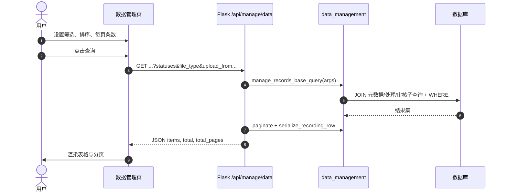
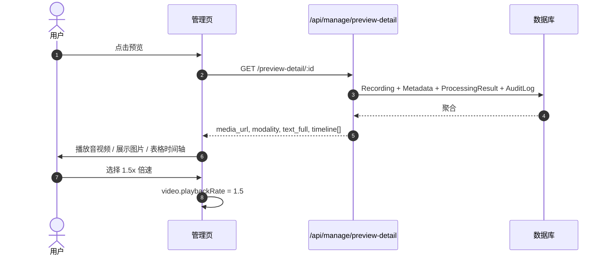
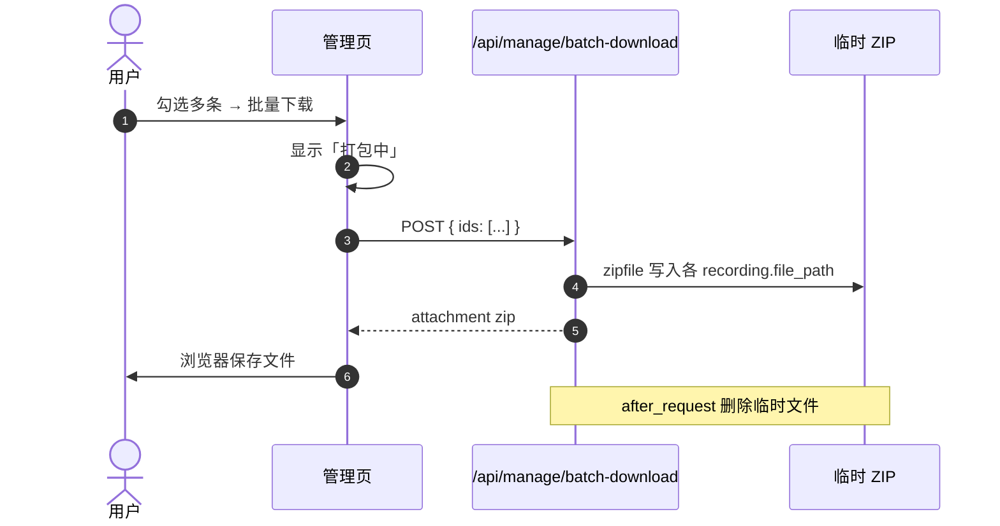
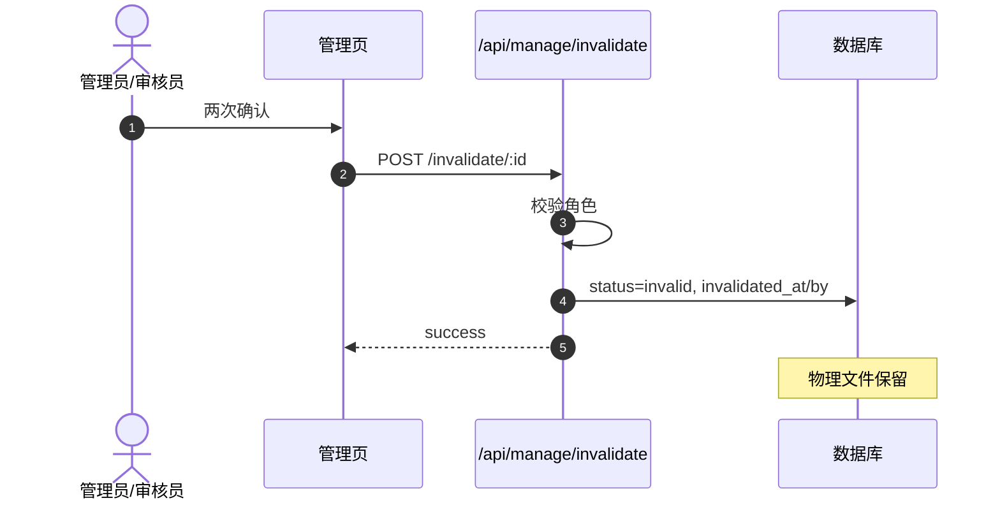
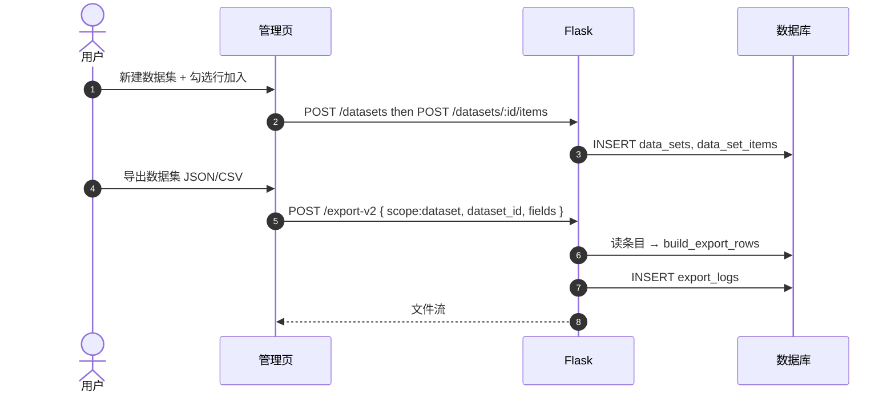
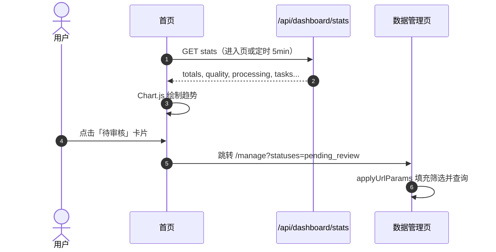

# 数据管理模块 — 详细设计

本文档对应「数据记录列表与全维度操作」「数据集自定义与结构化导出」「仪表板统计」三类需求，并与当前实现（`services/data_management.py`、`app.py` 路由、`manage_cn.html` / `index_cn.html`）对齐。

---

## 1. 目标与定位

数据管理模块是多模态数据资产的**管控中心**，支撑：

- **检索与操作**：列表、筛选、排序、分页、预览、下载、逻辑删除；
- **资产沉淀**：自定义数据集、版本与描述、增删条目；
- **合规与审计**：导出日志（导出人、时间、字段、条数）；
- **决策支持**：仪表板总览、处理进度、质量趋势、任务占比。

---

## 2. 数据模型扩展

| 实体 | 表名 | 说明 |
|------|------|------|
| 逻辑删除字段 | `recordings` | `invalidated_at`、`invalidated_by`；`status='invalid'` 表示无效 |
| 筛选模板 | `filter_templates` | 每用户多模板，`criteria_json` 存查询参数键值 |
| 数据集 | `data_sets` | 名称、描述、`version_label`、创建人 |
| 数据集条目 | `data_set_items` | `(dataset_id, recording_id)` 唯一 |
| 导出日志 | `export_logs` | `scope_type`（filter/dataset/ids/legacy_export）、格式、字段 JSON、条数 |

---

## 3. 状态与展示映射

| `recordings.status` | 界面标签（中文） |
|---------------------|------------------|
| `pending` | 待处理 |
| `pending_review` | 待审核 |
| `pending_fix` | 待修正 |
| `approved` | 通过 |
| `rejected` / `completed` 等 | 不通过 / 已完成（按业务沿用） |
| `invalid` | 无效 |

列表默认**排除** `invalid`，勾选「含无效数据」或「仅无效」可切换。

---

## 4. 功能设计

### 4.1 列表与查询

- **接口**：`GET /api/manage/data`
- **分页**：`page`、`per_page`（10 / 20 / 50 / 100，非法回退 10）
- **排序**：`sort_by`：`created_at` | `filename` | `status` | `task_no` | `uploaded_at`；`sort_order`：`asc` | `desc`
- **筛选**（可组合）：
  - `statuses`：逗号分隔多状态；
  - `file_type`：`video` | `audio` | `image`（元数据优先，缺省按扩展名）；
  - `upload_from` / `upload_to`：`coalesce(元数据.uploaded_at, recording.created_at)`；
  - `process_from` / `process_to`：按每条**最近一次** `processing_results.processed_at`；
  - `audit_from` / `audit_to`：按每条**最近一次** `audit_logs.created_at`；
  - `uploader_id`、`processor_id`、`auditor_id`；
  - `task_no`、`md5` 精准；
  - `include_invalid`、`invalid_only`。

返回行由 `serialize_recording_row` 组装：文件名、类型、状态中文标签、任务编号、上传/处理/审核人用户名、时间等。

**兼容**：旧参数 `filter=pending|completed|rejected` 仍映射为 `statuses`。

### 4.2 常用筛选模板

- `GET /api/manage/filter-templates`：当前用户模板列表；
- `POST`：body `{ name, criteria }`，`criteria` 与列表查询参数键一致；
- `DELETE /api/manage/filter-templates/<id>`：本人或管理员。

### 4.3 预览

- `GET /api/manage/preview/<id>`：轻量类型 + URL（兼容旧前端）。
- `GET /api/manage/preview-detail/<id>`：媒体 URL、模态、全文、`timeline` 数组。
- 前端：音视频 HTML5 控件，**倍速**通过 `playbackRate` 切换 0.5x～2x；图片点击新窗口放大；时间轴表格展示。

### 4.4 下载

- **单文件**：`GET /api/manage/download/<id>`，`send_file` 附件下载。
- **批量**：`POST /api/manage/batch-download`，body `{ ids: [] }`，服务端 `zipfile` 打包后响应附件，**临时文件在响应后删除**（`after_this_request`）。大文件量的「百分比进度」依赖浏览器下载行为；界面提供「打包中」提示（完整进度需 WebSocket/SSE 扩展）。

### 4.5 无效数据（逻辑删除）

- **权限**：`admin`、`inspector`。
- **接口**：`POST /api/manage/invalidate/<id>`；`DELETE /api/manage/recording/<id>` **改为同一逻辑删除**（不再物理删文件、不再删库行）。
- **交互**：前端二次确认。

### 4.6 自定义数据集

- `GET/POST /api/manage/datasets`：列表、创建（名称、描述、版本）；
- `DELETE /api/manage/datasets/<id>`：删条目再删集（创建人或管理员）；
- `POST/DELETE /api/manage/datasets/<id>/items`：body `{ recording_ids: [] }` 批量加入或移除。

### 4.7 结构化导出

- **新版**：`POST /api/manage/export-v2`  
  - `scope`：`filter` | `dataset` | `ids`；  
  - `filters`：与列表相同；`dataset_id` / `recording_ids`；  
  - `fields`：可选列数组；  
  - `format`：`json` | `csv`（CSV 带 BOM 便于 Excel）。  
  - 写 `export_logs`。
- **旧版**：`POST /api/manage/export` 仍支持简单 `dataType` + `json/csv`；ZIP 媒体包提示改用批量下载。

### 4.8 仪表板

- **接口**：`GET /api/dashboard/stats`
- **指标**：总条数（排除无效）、按类型粗分、待审核/待处理/通过量、审核通过率、今日/周/月处理次数、本周处理人排名、估算平均处理时长、任务进行中/已完成、近 7 日审核通过趋势、审核员维度通过率。
- **前端**：`index_cn.html` 使用 Chart.js 折线图；**默认 5 分钟** `setInterval` 刷新 + 手动刷新；卡片 `data-href` 跳转 `/manage?statuses=...`。

### 4.9 未实现/可增强项（与需求对照）

| 需求点 | 说明 |
|--------|------|
| 虚拟滚动 | 超大规模表格可接入 `vue-virtual-scroller` 等，当前为常规分页 |
| 批量 ZIP 精确进度 | 需服务端分块推送或估算体积 |
| 物理删除 | 按需求仅逻辑删除；若需清理磁盘应另设管理员「归档清理」流程 |

---

## 5. API 一览

| 方法 | 路径 | 说明 |
|------|------|------|
| GET | `/api/dashboard/stats` | 仪表板指标 |
| GET | `/api/manage/data` | 分页列表 |
| GET | `/api/manage/users-options` | 下拉用户 |
| GET | `/api/manage/preview/<id>` | 简单预览 |
| GET | `/api/manage/preview-detail/<id>` | 完整预览 |
| GET | `/api/manage/download/<id>` | 单文件下载 |
| POST | `/api/manage/batch-download` | 批量 ZIP |
| POST | `/api/manage/invalidate/<id>` | 逻辑删除 |
| DELETE | `/api/manage/recording/<id>` | 同逻辑删除 |
| POST | `/api/manage/export` | 旧版导出 |
| POST | `/api/manage/export-v2` | 新版可配置字段导出 |
| GET/POST | `/api/manage/filter-templates` | 筛选模板 |
| DELETE | `/api/manage/filter-templates/<id>` | 删模板 |
| GET/POST | `/api/manage/datasets` | 数据集 |
| DELETE | `/api/manage/datasets/<id>` | 删数据集 |
| POST/DELETE | `/api/manage/datasets/<id>/items` | 增删条目 |

---

## 6. 时序图（Mermaid）

### 6.1 多条件检索与分页列表

### 6.2 预览（含倍速与时间轴）

### 6.3 批量打包下载

### 6.4 逻辑删除（无效）

### 6.5 自定义数据集与导出

### 6.6 仪表板刷新与下钻

---

## 7. 部署与迁移

- 新增表：`filter_templates`、`data_sets`、`data_set_items`、`export_logs`；`recordings` 新增 `invalidated_at`、`invalidated_by`。  
- 执行 `db.create_all()` 或使用迁移工具为已有库 **ALTER** 增加列/表。

---

*文档版本与仓库实现同步维护。*
