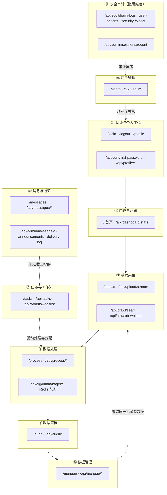
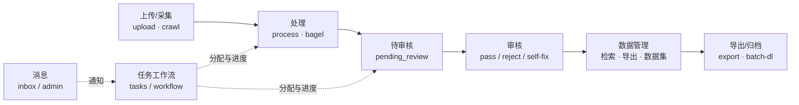
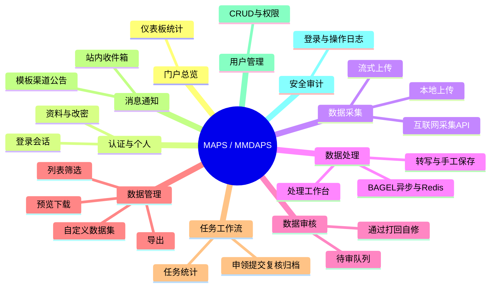
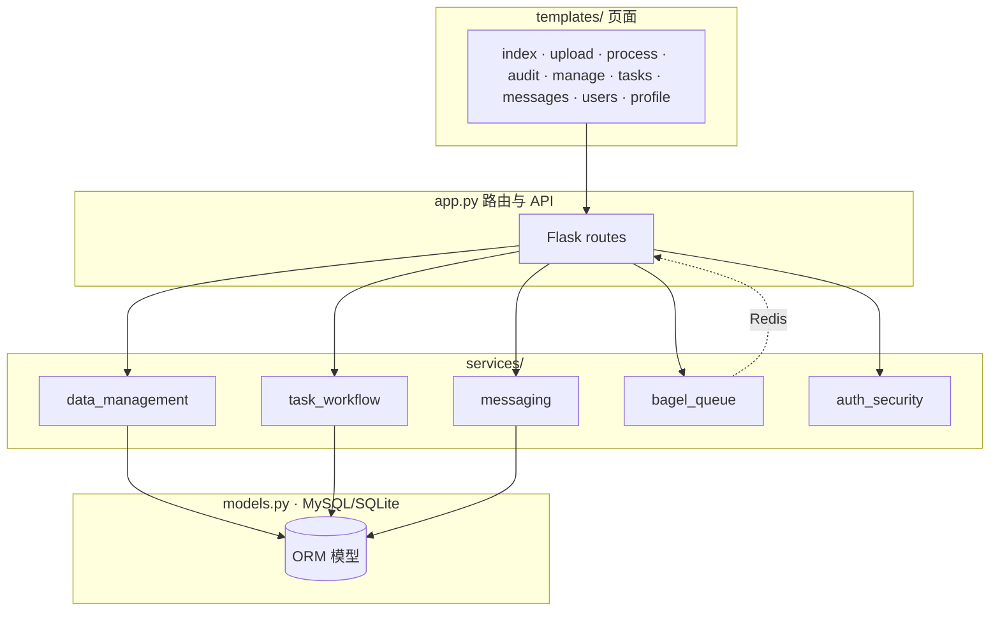

# MAPS / MMDAPS 功能模块划分（配图代码）

以下均为 **Mermaid** 源码，可复制到支持 Mermaid 的 Markdown 预览、Typora、Notion、GitLab/GitHub 或 [mermaid.live](https://mermaid.live) 中渲染。

---

## 图 1：模块分解（按业务域）

---

## 图 2：核心业务链路（录制生命周期）

---

## 图 3：思维导图（总览）

---

## 图 4：实现映射（页面 ↔ 服务层）

---

## 使用说明

- **单文件导出 PNG/SVG**：打开 [mermaid.live](https://mermaid.live)，粘贴某一图中的代码块内容，使用菜单导出。  
- 与分层架构说明并列阅读：**[ARCHITECTURE_LAYERS.md](./ARCHITECTURE_LAYERS.md)**。
