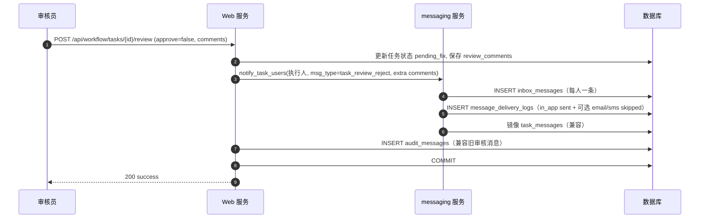
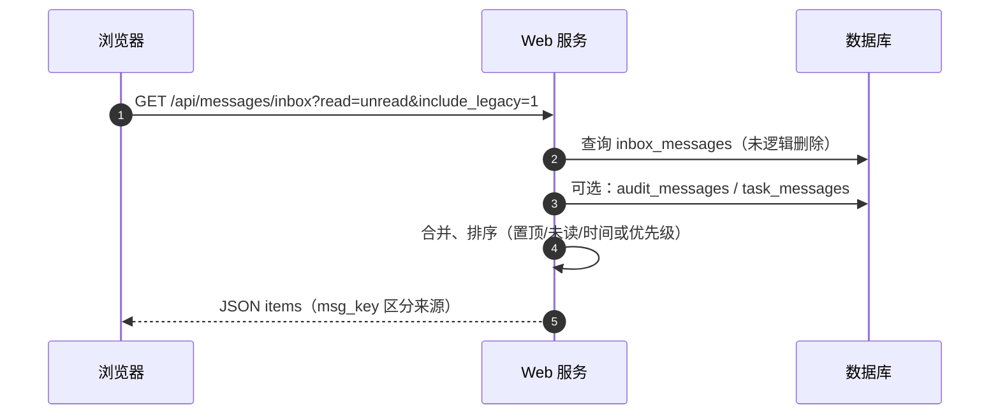
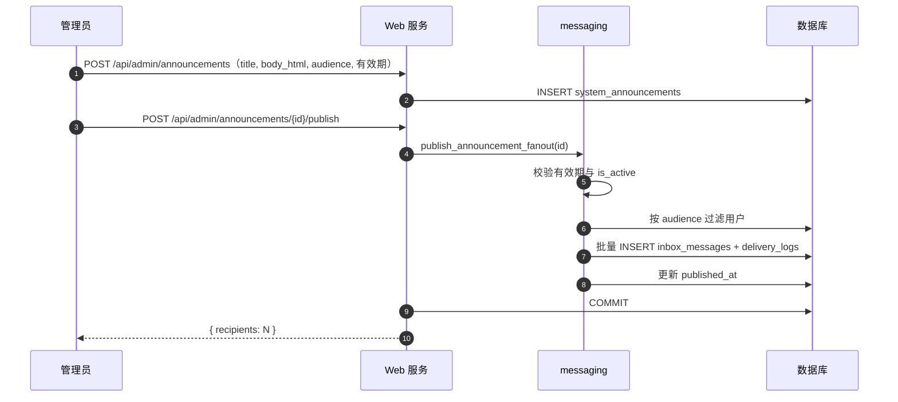
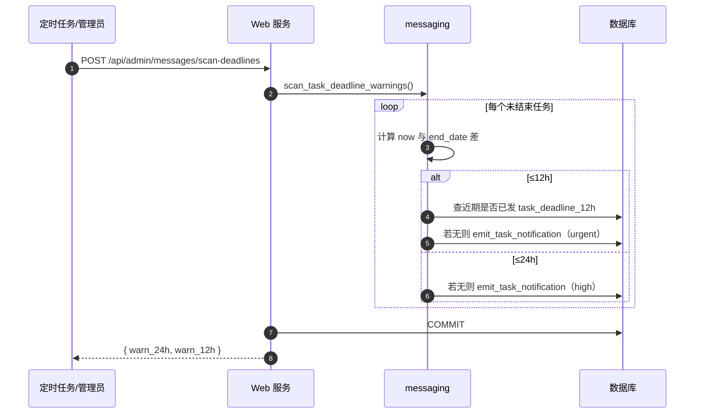
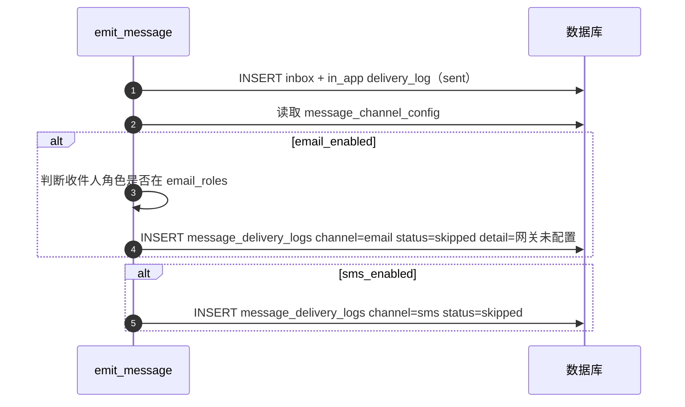

# 消息管理模块 — 详细设计

本文档描述 MMDAPS **统一站内信、模板化触发、多渠道审计与后台管理** 的实现，与 `models.py`（`InboxMessage`、`MessageDeliveryLog`、`MessageTemplate`、`SystemAnnouncement`、`MessageChannelConfig`）、`services/messaging.py`、`app.py` 路由及 `messages_*.html` 对齐。

---

## 1. 目标与范围

| 目标 | 说明 |
|------|------|
| 事件驱动 | 任务工作流、数据审核打回、账号生命周期等节点自动写入收件箱并记投递日志。 |
| 角色精准 | 按任务参与人、角色（如质检）、管理员等定向 `recipient_id` 列表。 |
| 统一展示 | 任务 / 审核 / 账号 / 系统四类 `category`，`priority` 区分紧急程度。 |
| 用户自助 | 筛选、已读、全部已读、置顶、逻辑删除（个人列表隐藏，审计表保留）。 |
| 后台与合规 | 管理员维护模板与渠道开关、发布公告、导出投递日志 JSON。 |

**实时性说明**：当前以 **站内信 + HTTP 接口** 为主；前端消息中心通过打开页面或自行轮询 `GET /api/messages/inbox` 刷新。若需真 WebSocket/SSE 推送，可在本模块之上增加推送网关，不改变收件箱与审计模型。

---

## 2. 数据模型

### 2.1 `inbox_messages`（`InboxMessage`）

| 字段 | 说明 |
|------|------|
| `recipient_id` | 接收人 |
| `sender_type` | `system` / `super_admin` / `admin` / `user` |
| `sender_id` | 可空（系统触发） |
| `category` | `task` / `audit` / `account` / `system` |
| `msg_type` | 业务子类型，如 `task_review_reject`、`account_locked` |
| `priority` | `urgent` / `high` / `medium` / `low` |
| `title` / `summary` / `body` | 展示与摘要 |
| `business_type` / `business_id` | 关联业务（如 `task` + 任务 id） |
| `action_url` | 一键跳转（如 `/tasks?highlight={id}`） |
| `read_at` / `pinned_at` / `user_deleted_at` | 已读、置顶、个人逻辑删除 |

### 2.2 `message_delivery_logs`（`MessageDeliveryLog`）

每条站内信对应至少一条 `channel=in_app`、`status=sent` 记录；若开启邮件/短信开关，额外写入 `email`/`sms` 渠道记录，当前实现为 **网关未对接** 时的 `skipped` 桩，满足审计字段占位与后续扩展。

### 2.3 `message_templates`（`MessageTemplate`）

- `template_key` 与业务 `msg_type` 对齐（或显式 `use_template_key`）。
- 正文支持占位符 **`{{变量名}}`**，由 `services/messaging.render_vars` 替换。
- 管理员可 `PUT /api/admin/message-templates/<key>` 编辑、启停。

### 2.4 `system_announcements`（`SystemAnnouncement`）

- `body_html` 存储富文本 HTML；扇出时剥离标签生成纯文本正文写入站内信。
- `audience_json`：`{"mode":"all"|"roles"|"departments","roles":[],"departments":[]}`。
- `valid_from` / `valid_until`：在 `publish_announcement_fanout` 时校验，不在有效期内则不发送。

### 2.5 `message_channel_config`（`MessageChannelConfig`，`id=1` 单例）

- `email_enabled` / `sms_enabled`。
- `email_roles_json`：允许接收邮件的角色列表（空表示不限制角色，仍受网关桩限制）。

### 2.6 兼容旧表

- `task_messages`、`audit_messages` 仍可能产生历史数据；`GET /api/messages/inbox?include_legacy=1`（默认）会 **合并** 为统一列表，键为 `audit:{id}` / `task:{id}`；新产生数据优先写入 `inbox_messages`，并仍可向 `task_messages` **镜像** 一行以保持旧页面兼容（由 `notify_task_users` 控制）。

---

## 3. 业务触发矩阵（摘要）

| 场景 | msg_type（示例） | 接收人 |
|------|------------------|--------|
| 任务发布（公海） | `task_published_pool` | 可申领角色用户 |
| 手动/自动分配 | `task_assigned` / `task_assigned_auto` | 被指派人 |
| 公海申领成功 | `task_claim_success` | 申领人 |
| 个人配额完成 | `task_quota_completed` | 执行人 + 创建人 |
| 提交复核 | `task_submit_review` | 质检角色 |
| 复核通过/打回 | `task_review_pass` / `task_review_reject` | 创建人 / 执行人（打回带意见变量） |
| 评分完成 | `task_scored` | 参与人；`task_pending_archive` 额外通知管理员 |
| 归档 | `task_archived` | 参与人 + 创建人 |
| 暂停/终止 | `task_paused` / `task_terminated` | 相关人 |
| 退领申请/通过/驳回 | `task_return_request` / `task_return_approved` / `task_return_rejected` | 发起人 / 申请人 |
| 截止 24h/12h | `task_deadline_24h` / `task_deadline_12h` | 参与人（去重窗口内不重复） |
| 审核打回（数据） | `audit_reject` | 原处理人（同时保留 `AuditMessage`） |
| 账号创建/重置/启停/注销/锁定 | `account_*` | 目标用户 |
| 首次改密提醒 | `account_first_login` | 当前用户（去重窗口） |
| 系统公告 | `sys_announcement` | 按受众扇出 |

**截止扫描**：`POST /api/admin/messages/scan-deadlines`（管理员）调用 `scan_task_deadline_warnings`，建议在计划任务中定时触发。

---

## 4. 主要 API

| 方法 | 路径 | 说明 |
|------|------|------|
| GET | `/messages` | 消息中心页面 |
| GET | `/api/messages/inbox` | 筛选：`read`、`category`、`q`、`business_id`、`from`/`to`、`sort`、`include_legacy` |
| GET | `/api/messages/unread-count` | 未读数（含旧表） |
| POST | `/api/messages/inbox/<id>/read` | 单条已读 |
| POST | `/api/messages/inbox/read-all` | 全部已读（含旧表） |
| POST | `/api/messages/inbox/<id>/pin` | 置顶/取消 |
| DELETE | `/api/messages/inbox/<id>` | 逻辑删除 |
| POST | `/api/messages/inbox/batch-delete` | 批量逻辑删除 |
| POST | `/api/messages/legacy/read` | body: `{source, id}` 旧消息已读 |
| GET | `/api/admin/message-templates` | 模板列表 |
| PUT | `/api/admin/message-templates/<key>` | 更新模板 |
| GET/PUT | `/api/admin/message-channels` | 渠道开关 |
| GET/POST | `/api/admin/announcements` | 公告列表/创建 |
| POST | `/api/admin/announcements/<id>/publish` | 发布公告扇出 |
| GET | `/api/admin/message-delivery-log` | 投递审计列表 |
| GET | `/api/admin/message-delivery-log/export` | JSON 导出 |
| POST | `/api/admin/messages/scan-deadlines` | 任务截止扫描 |

---

## 5. 列表排序规则

默认：**置顶优先 → 未读优先 → 时间倒序**（或按 `sort=priority` 在相同前提下按优先级排序）。实现见 `api_messages_inbox` 中 `_sort_key`。

---

## 6. 数据库迁移注意

新建表及字段需通过 `db.create_all()`（新库）或 DBA 迁移（已有库）。应用启动时在 `app.app_context()` 内调用 `ensure_default_templates()` 与 `get_or_create_channel_config()` 做种子数据。

---

## 7. 详细设计时序图（Mermaid）

### 7.1 任务复核打回 → 站内信 + 审计日志

### 7.2 用户打开消息中心（含合并旧数据）

### 7.3 管理员发布公告扇出

### 7.4 任务截止扫描（24h/12h）

### 7.5 渠道配置与投递审计桩（邮件）

---

## 8. 后续扩展

- 对接真实 SMTP / 短信网关：在 `_channel_stub_logs` 位置改为异步任务并更新 `status`/`detail`。
- 真实时推送：WebSocket 广播 `recipient_id` 维度事件，payload 指向 `inbox_message_id`。
- 已读回写投递日志：若合规要求「已读时间」进入审计表，可在标记已读时追加 `MessageDeliveryLog` 或扩展字段。

---

*文档与代码同步维护。*
