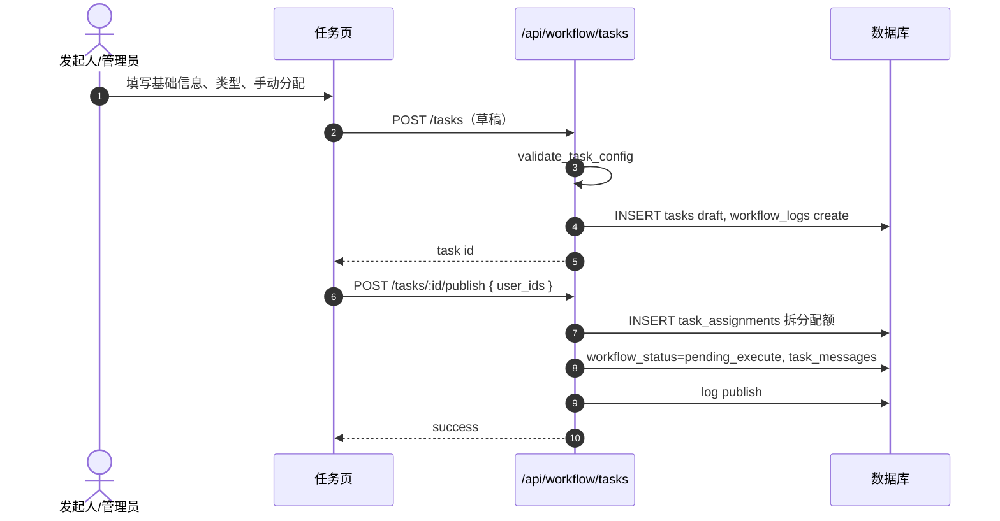
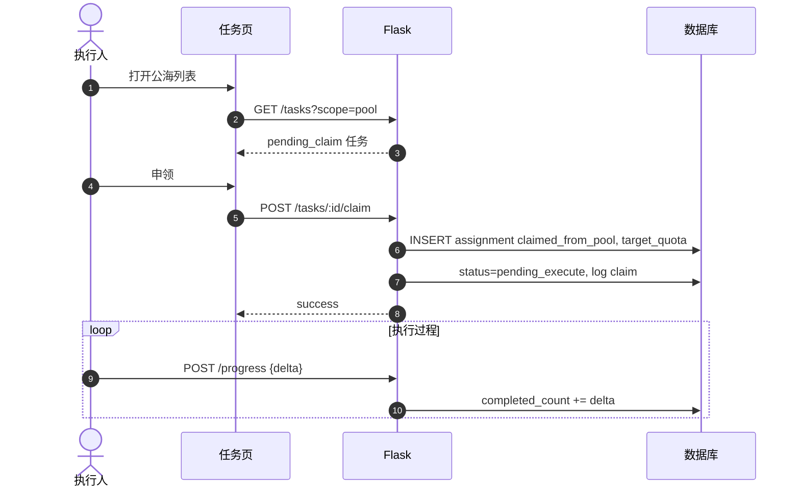
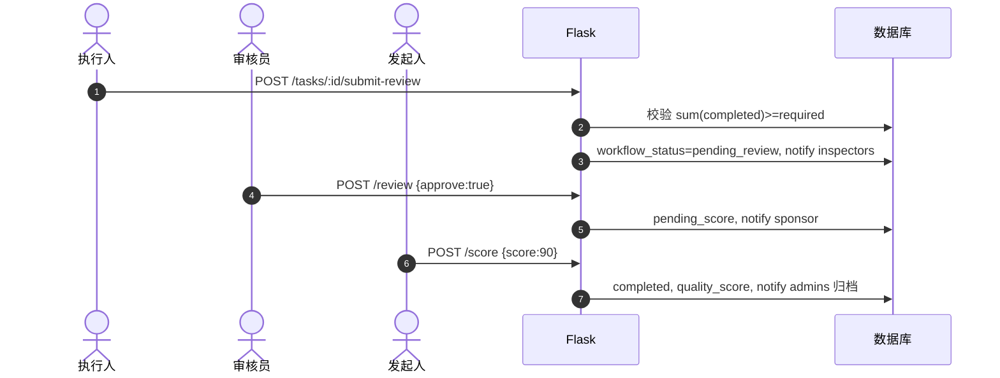
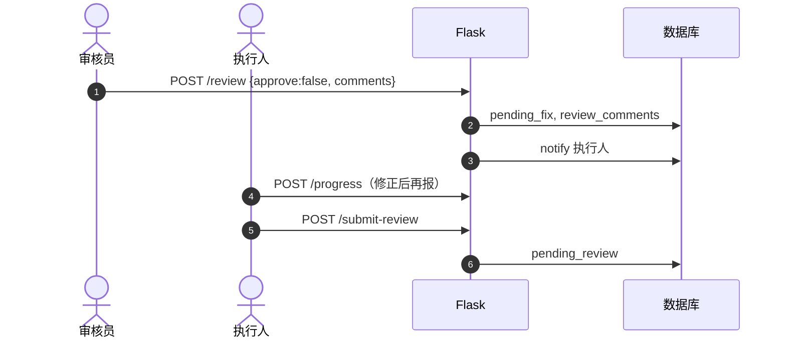
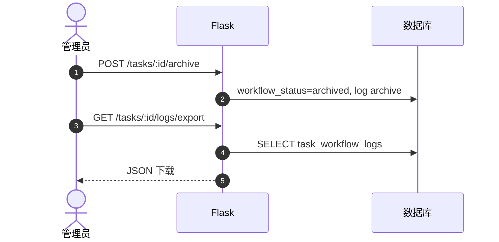
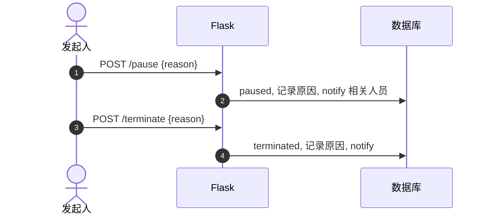
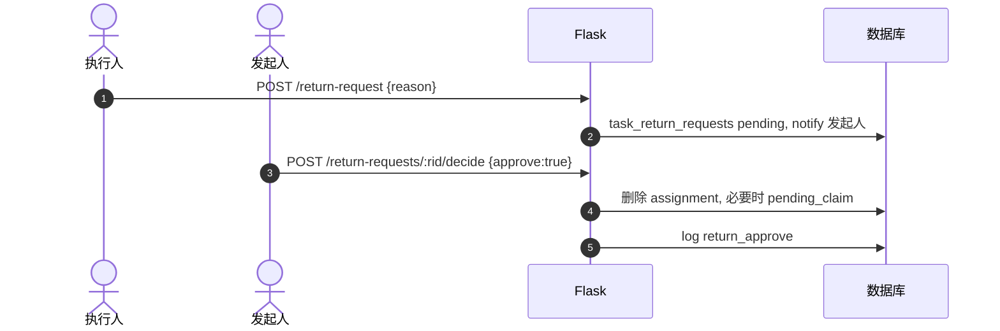

# 任务管理模块 — 详细设计

本文档对应需求中「任务发起 → 申领 → 执行 → 复核 → 评分 → 归档」闭环及异常（暂停/终止/退领），与实现代码（`models.py` 中 `Task` / `TaskAssignment` 扩展及 `TaskWorkflowLog` / `TaskReturnRequest` / `TaskMessage`，`services/task_workflow.py`，`app.py` 中 `/api/workflow/*`，`tasks_cn.html`）一致。

---

## 1. 目标与范围

| 项 | 说明 |
|----|------|
| 目标 | 以任务为载体串联采集、处理、审核与归档，标准化状态与权限 |
| 角色 | 管理员、采集员（可作发起人）、处理执行侧复用 `recorder`、审核侧 `inspector` |
| 边界 | 与「消息」通过 `task_messages` 衔接；与数据通过可选 `recordings.business_task_id` 关联（后续可强化） |

---

## 2. 数据模型

### 2.1 任务 `tasks`（扩展字段）

| 字段 | 说明 |
|------|------|
| `task_no` | 全局唯一编号（如 `TASK-时间-随机`） |
| `priority` | `high` / `medium` / `low` |
| `task_category` | `collect`（采集）/ `process`（处理）/ `audit`（审核类调度） |
| `task_subtype` | 业务子类型文案：`upload`/`record`/`crawl`、`transcribe`/`describe` 等 |
| `assign_mode` | `auto` 自动均衡 / `manual` 手动 / `pool` 公海申领 |
| `max_claim_per_user` | 公海下单人最大申领配额（件数） |
| `acceptance_criteria` | 验收标准 |
| `workflow_status` | 核心状态机（见下） |
| `published_at` | 发布时间 |
| `pause_reason` / `paused_at` | 暂停 |
| `terminate_reason` / `terminated_at` | 提前终止 |
| `quality_score` / `scored_by` / `scored_at` | 发起人质量评分 |
| `review_comments` | 复核意见（尤其打回） |
| `status` | 兼容旧版：`active`/`completed`/`expired`，与工作流同步 |

### 2.2 分配 `task_assignments`（扩展）

| 字段 | 说明 |
|------|------|
| `target_quota` | 该执行人承担的目标件数 |
| `completed_count` | 已完成件数 |
| `claimed_from_pool` | 是否来自公海申领 |

### 2.3 `task_workflow_logs`

记录操作类型、操作前后状态、操作人、时间、JSON 详情；**仅追加**，满足审计。

### 2.4 `task_return_requests`

公海退领：`pending` → 发起人/管理员 `approved`/`rejected`。

### 2.5 `task_messages`

任务通知（收件人、任务 ID、标题、正文、已读时间）。

### 2.6 `recordings.business_task_id`

可选关联业务任务，便于统计「某任务下产生的数据」。

---

## 3. 状态机（workflow_status）

| 状态 | 含义 |
|------|------|
| `draft` | 草稿，未发布 |
| `pending_claim` | 已发布，公海待申领 |
| `pending_execute` | 已分配/已申领，待执行 |
| `pending_review` | 完成量达标后提交，待复核 |
| `pending_fix` | 复核打回，待修正后再提交 |
| `pending_score` | 复核通过，待发起人评分 |
| `completed` | 已评分完成 |
| `archived` | 管理员归档（不可改） |
| `paused` | 暂停 |
| `terminated` | 提前终止 |

**说明**：手动/自动分配在发布成功后直接进入 `pending_execute`；公海为 `pending_claim`，首次申领后 `pending_execute`。

**类别与角色**（可操作/可申领）：

- `collect`、`process` → `recorder`  
- `audit`（任务调度类）→ `inspector`  

---

## 4. 权限摘要

| 操作 | 角色 |
|------|------|
| 创建草稿 | `admin`、`recorder`（发起人） |
| 发布 / 暂停 / 终止 | 发起人（`created_by`）或 `admin` |
| 公海申领 / 上报进度 / 提交复核 | 对应执行人（分配或申领记录） |
| 复核 | `inspector` 或 `admin` |
| 评分 | 发起人或 `admin` |
| 归档 | `admin` |
| 退领审批 | 发起人或 `admin` |
| 导出任务日志 JSON | `admin` |

---

## 5. 核心 API

| 方法 | 路径 | 说明 |
|------|------|------|
| GET/POST | `/api/workflow/tasks` | 列表（scope=all/mine/pool）/ 创建草稿 |
| GET | `/api/workflow/tasks/<id>` | 详情 + 分配 + 日志 |
| POST | `/api/workflow/tasks/<id>/publish` | 发布（body 可含 `user_ids` 手动） |
| POST | `/api/workflow/tasks/<id>/claim` | 公海申领 |
| POST | `/api/workflow/tasks/<id>/progress` | `{delta}` 增加完成量 |
| POST | `/api/workflow/tasks/<id>/submit-review` | 总完成量≥目标时提交复核 |
| POST | `/api/workflow/tasks/<id>/review` | `{approve, comments}` |
| POST | `/api/workflow/tasks/<id>/score` | `{score}` 0–100 |
| POST | `/api/workflow/tasks/<id>/archive` | 归档 |
| POST | `/api/workflow/tasks/<id>/pause` | `{reason}` |
| POST | `/api/workflow/tasks/<id>/terminate` | `{reason}` |
| POST | `/api/workflow/tasks/<id>/return-request` | `{reason}` |
| POST | `/api/workflow/tasks/return-requests/<rid>/decide` | `{approve}` |
| GET | `/api/workflow/tasks/<id>/logs/export` | 导出日志 JSON |
| GET | `/api/workflow/task-messages/my` | 我的任务消息 |

兼容接口：`GET /api/tasks/statistics` 已增强，返回 `total_videos`、`total_duration`、`tasks`（含进度与 `workflow_status`）、`user_performance`。

---

## 6. 业务规则要点

1. **发布校验**：截止时间 ≥ 开始时间；`required_count ≥ 1`；类别合法。  
2. **自动分配**：在匹配角色用户中按「当前进行中任务数」升序，最多 5 人拆分配额。  
3. **手动分配**：`user_ids` 平均拆分 `required_count`。  
4. **公海**：`remaining = required_count - sum(target_quota)`；申领 `min(max_claim_per_user, remaining)`。  
5. **提交复核**：`sum(completed_count) ≥ required_count`。  
6. **打回**：必须填写 `comments`，状态 `pending_fix`，通知执行人。  
7. **归档**：仅 `completed` → `archived`。

---

## 7. 与需求的差异与扩展点

| 需求 | 当前实现 |
|------|-----------|
| 消息管理统一中心 | `task_messages` 表 + 查询接口，可对接统一模块 |
| 自动按负载均衡 | 已实现粗粒度按进行中分配数 |
| 个人列表多维度筛选 | 前端可通过 `workflow_status`、`task_category` 查询参数扩展（当前 scope 简化为 mine/pool/all） |
| 录音/上传自动计入任务进度 | 需在上传/处理 API 写 `business_task_id` 并 `+progress`，可后续接 |

---

## 8. 时序图（Mermaid）

### 8.1 创建、校验与发布（手动分配）

### 8.2 公海申领与执行进度

### 8.3 提交复核、复核通过与评分

### 8.4 复核打回与待修正闭环

### 8.5 归档与日志审计

### 8.6 暂停 / 终止（异常流程）

### 8.7 公海退领审批

---

## 9. 数据库迁移

新增列与表需执行 `db.create_all()` 或迁移脚本；旧任务无 `task_no` 时可在后台批量补全或保持可空并由界面仅显示 `id`。

---

*文档与代码同步维护。*
