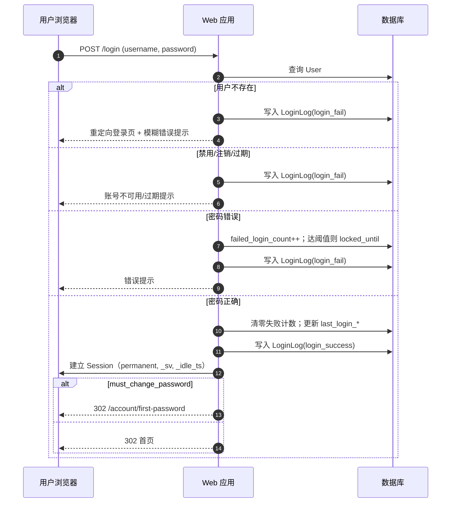
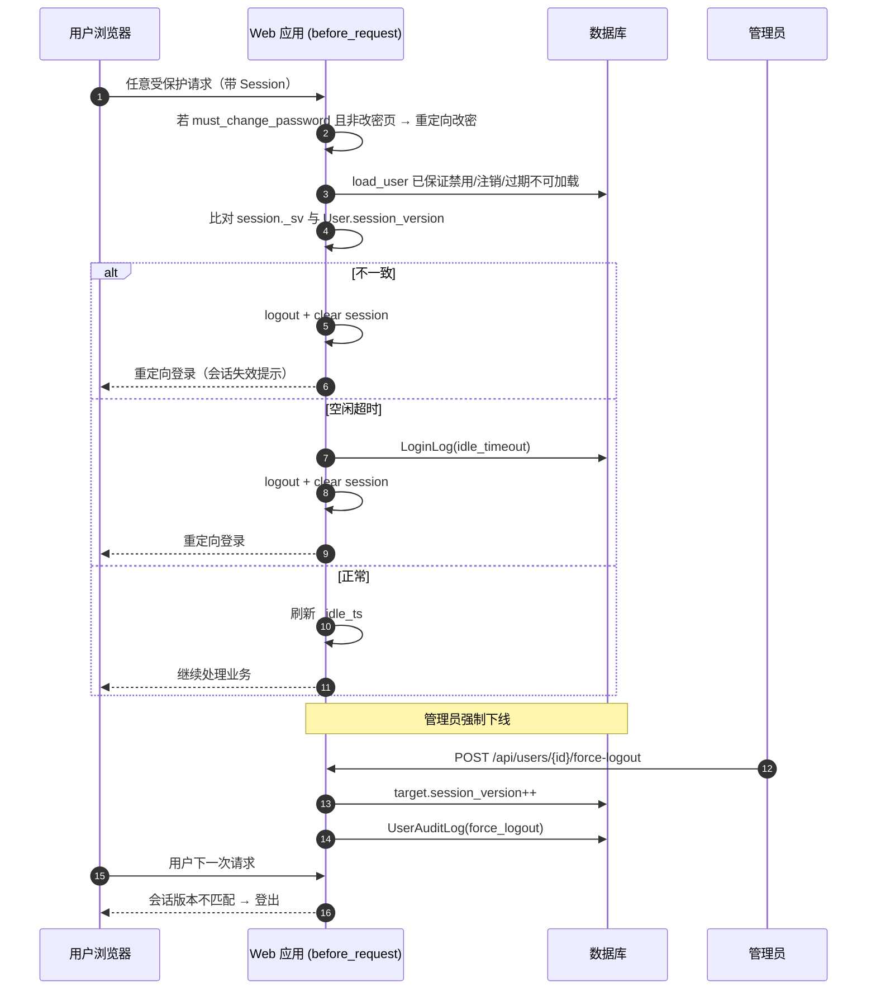
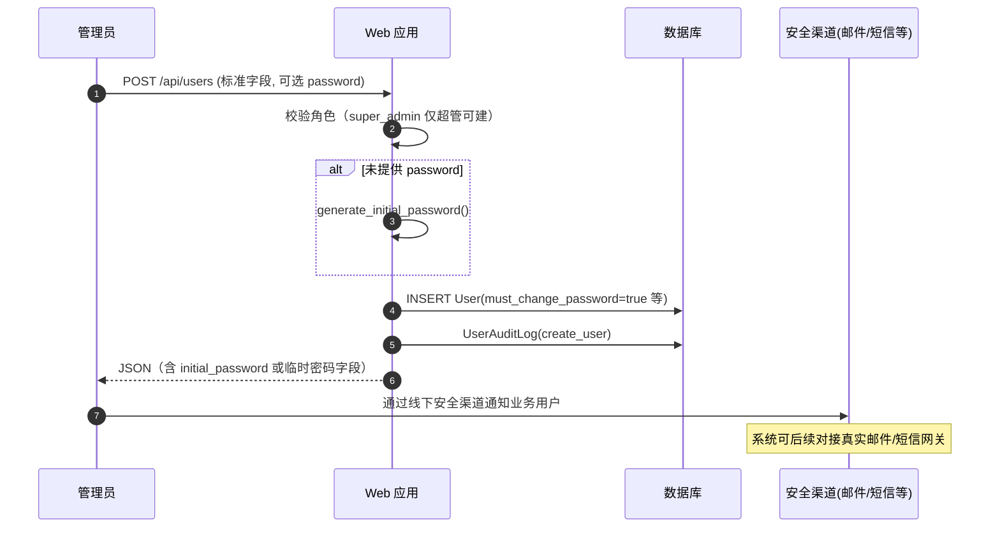

# 用户管理与 RBAC 模块 — 详细设计

本文档描述多模态数据采集处理系统（MMDAPS）的**身份认证、基于角色的访问控制（RBAC）、账号生命周期与审计**实现，并与当前代码（`models.py`、`services/auth_security.py`、`app.py`、相关模板）对齐。

---

## 1. 目标与原则

| 原则 | 说明 |
|------|------|
| 无自助注册 | 系统不开放公开注册；账号仅由**超级管理员 / 系统管理员**创建。 |
| 最小权限 | 四类标准角色，菜单与 API 按角色隔离；敏感操作仅管理员可执行。 |
| 会话可撤销 | 通过 `session_version` 与前端会话字段联动，支持强制下线。 |
| 操作留痕 | 登录/登出、账号与权限变更写入不可篡改业务日志表（应用层只追加）。 |

---

## 2. 角色定义与权限边界

| 角色代码 | 名称（业务） | 权限概要 |
|----------|--------------|----------|
| `super_admin` | 超级管理员 | 全功能；可创建/管理含 `admin` 在内的账号；可分配 `super_admin`（仅该角色可操作）。 |
| `admin` | 系统管理员 | 业务账号创建与角色分配、任务与数据管理、统计看板、安全审计查询与导出；**不含**仅超级管理员可做的系统核心配置（若后续单独拆分）。 |
| `recorder` | 数据采集与处理人员 | 个人任务与采集/处理/算法调用、个人数据与通知；**无**审核、全量数据管理、任务发布、用户管理。 |
| `inspector` | 数据质检审核人员 | 审核任务与待审数据、提交审核结果、个人统计与通知；**无**采集、任务发布、全量数据管理、用户管理。 |

**实现说明**：路由与 API 中通过 `_is_system_admin()`（`admin` ∪ `super_admin`）与 `_is_super_admin()` 进行校验；部分业务流程（如任务申领、审核入口）已包含 `super_admin` 以便运维兜底。前端侧栏「用户管理」对 `admin` / `super_admin` 开放；「数据审核」对 `admin` / `super_admin` / `inspector` 开放。

---

## 3. 数据模型

### 3.1 用户表 `users`（核心字段）

| 字段 | 说明 |
|------|------|
| `username` | 唯一登录账号/工号 |
| `email` | 邮箱（创建时可占位） |
| `password_hash` | 密码哈希 |
| `role` | `super_admin` / `admin` / `recorder` / `inspector` |
| `full_name`, `department`, `phone` | 标准资料 |
| `is_active` | 启用/禁用（禁用不可登录，数据保留） |
| `is_locked_account` | 逻辑注销标记（永久锁定，**不可恢复**） |
| `account_valid_until` | 账号有效期（空表示不限制） |
| `must_change_password` | 首次登录或管理员重置后须改密 |
| `failed_login_count`, `locked_until` | 连续失败锁定（见安全策略） |
| `session_version` | 递增使用户端会话失效（强制下线/改密等） |
| `last_login_at`, `last_login_ip` | 最近登录审计与「近期登录」辅助展示 |

### 3.2 登录日志 `login_logs`

记录成功/失败登录、登出、空闲超时等：`user_id`、`username_attempted`、`event_type`、`success`、`ip_address`、`user_agent`、`message`、`created_at`。

### 3.3 用户审计日志 `user_audit_logs`

记录账号创建、启停、角色变更、注销、管理员重置密码、强制下线、个人资料修改等：`actor_id`、`target_user_id`、`action_type`、`detail_json`、`created_at`。

---

## 4. 安全策略

| 项 | 策略 |
|----|------|
| 密码复杂度 | 长度 ≥ 8；包含大写、小写、数字、特殊字符（`validate_password_strength`）。 |
| 暴力破解 | 连续 **5** 次密码错误锁定 **30** 分钟（`MAX_FAILED_ATTEMPTS` / `LOCK_MINUTES`）。 |
| 会话空闲 | 无操作超过配置时间（默认 **30** 分钟，`SESSION_IDLE_TIMEOUT`）清除会话并记 `idle_timeout` 日志。 |
| 会话一致性 | 登录后会话中写入 `_sv`；每次请求比对 `User.session_version`，不一致则登出并提示可能被强制下线。 |
| 强制下线 | 管理员调用接口使目标用户 `session_version++`，下一会话校验即失效。 |

---

## 5. 主要接口与页面

| 类型 | 路径 | 说明 |
|------|------|------|
| 页面 | `GET /login` / `POST` | 表单登录 |
| 页面 | `GET /logout` | 登出并清会话 |
| 页面 | `GET /account/first-password` | 必须改密（`must_change_password`） |
| 页面 | `GET /profile` | 个人中心（资料、改密、本人日志） |
| API | `GET/POST /api/users` | 列表（`?list=all`）、创建（仅系统管理员） |
| API | `GET/PUT/DELETE /api/users/<id>` | 查询、更新；**DELETE** 为逻辑注销 |
| API | `PUT /api/users/<id>/status` | 启用/禁用（**已注销账号拒绝变更**） |
| API | `POST /api/users/<id>/reset-password` | 管理员重置密码并强制下次改密 |
| API | `POST /api/users/<id>/force-logout` | 强制下线 |
| API | `GET/PUT /api/profile/me` | 当前用户资料（不含改角色） |
| API | `POST /api/profile/change-password` | 原密码校验后修改密码 |
| API | `GET /api/profile/my-login-logs` | 本人登录日志 |
| API | `GET /api/profile/my-audit-trail` | 与本人相关的审计摘要 |
| API | `GET /api/audit/login-logs` | 管理员可查全部；普通用户仅能查自身（`user_id` 被强制为当前用户） |
| API | `GET /api/audit/user-actions` | 用户类审计列表（管理员） |
| API | `GET /api/audit/security-export` | 登录+审计 JSON 导出（管理员） |
| API | `GET /api/admin/sessions/recent` | 近 30 分钟有登录时间的用户列表（辅助排查） |

---

## 6. 账号状态机（简要）

- **正常**：`is_active=True` 且 `is_locked_account=False`，未过期且未在 `locked_until` 锁定期。
- **禁用**：`is_active=False` → 无法登录；可再次被管理员启用（**未注销前提下**）。
- **锁定（失败次数）**：`locked_until` 到期后自动恢复尝试（成功登录会清零计数）。
- **逻辑注销**：`is_locked_account=True`（通常同时 `is_active=False`）→ **不可修改、不可启用、不可重置密码**；历史数据与日志保留。

---

## 7. 与其他模块的关系

- **任务工作流**：创建/申领等权限在 `services/task_workflow.py` 与 `app.py` 中与角色联动。
- **数据审核 / 管理**：审核类接口校验 `inspector` / `admin` / `super_admin`；全量数据能力主要面向管理员（具体以各路由为准）。
- **消息通知**：仍按业务 recipient 过滤，与登录用户绑定。

---

## 8. 初始化与迁移注意

- 首次 `db.create_all()` 会创建新表与新列；**已有数据库**若由旧版升级，需在数据库层执行 `ALTER TABLE` 增加列（或重建库），否则运行时会报错。
- 默认种子用户 `testuser` 角色为 `super_admin`，密码需符合复杂度（示例：`Test@pwd1`）；生产环境请删除或修改。

---

## 9. 详细设计时序图（Mermaid）

### 9.1 账号密码登录（含锁定与首次改密）



### 9.2 会话校验、空闲超时与强制下线



### 9.3 管理员创建账号与初始密码交付



### 9.4 逻辑注销与禁用区别

```mermaid
sequenceDiagram
    autonumber
    participant A as 管理员
    participant S as Web 应用
    participant D as 数据库

    rect rgb(245,245,245)
    Note over A,D: 禁用（可逆）
    A->>S: PUT /api/users/{id}/status {active:false}
    S->>D: is_active=false; session_version++（踢出现有会话）
        S->>D: UserAuditLog(disable)
    end

    rect rgb(245,245,245)
    Note over A,D: 逻辑注销（不可逆）
    A->>S: DELETE /api/users/{id}
    S->>D: is_locked_account=true; is_active=false; session_version++
    S->>D: UserAuditLog(account_deactivate)
    S-->>A: 成功（不可再启用）
    end
```

### 9.5 个人改密与审计记录

```mermaid
sequenceDiagram
    autonumber
    participant U as 用户
    participant S as Web 应用
    participant D as 数据库

    U->>S: POST /api/profile/change-password (old, new)
    S->>S: check_password(old)
    alt 原密码错误
        S-->>U: 400
    else 新密码强度不足
        S-->>U: 400 + 原因
    else 通过
        S->>D: 更新 password_hash; must_change_password=false
        S->>D: session_version++; UserAuditLog(password_change_self)
        S->>U: 更新 session._sv
        S-->>U: 200
    end
```

---

## 10. 已知扩展点

- **通知推送**：创建/重置密码后发送邮件或短信需在业务层对接网关，当前实现为接口返回初始密码由管理员安全转交。
- **按钮级权限**：前端可按角色隐藏按钮；最终必须以 **API 侧校验** 为准。
- **数据级权限**：列表/导出等接口可按 `recorder` 仅本人数据、`inspector` 仅审核范围等进一步收紧（与数据管理模块联调）。

---

*文档版本与实现同步维护；修改安全常量在 `services/auth_security.py` 与 `config.py` 中统一调整。*
